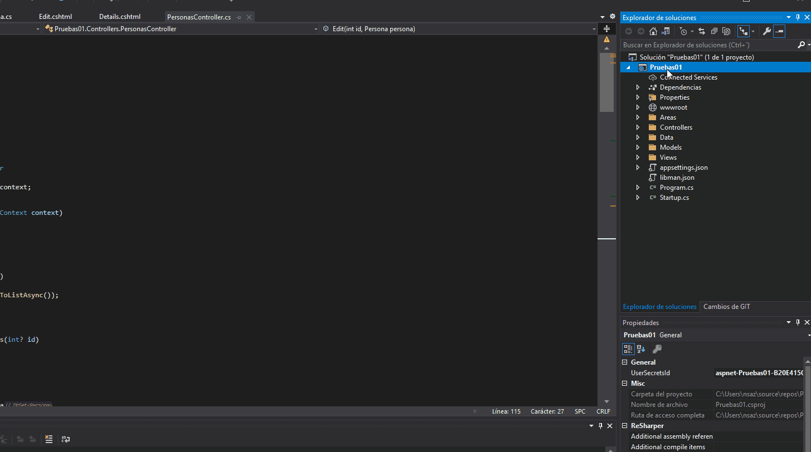
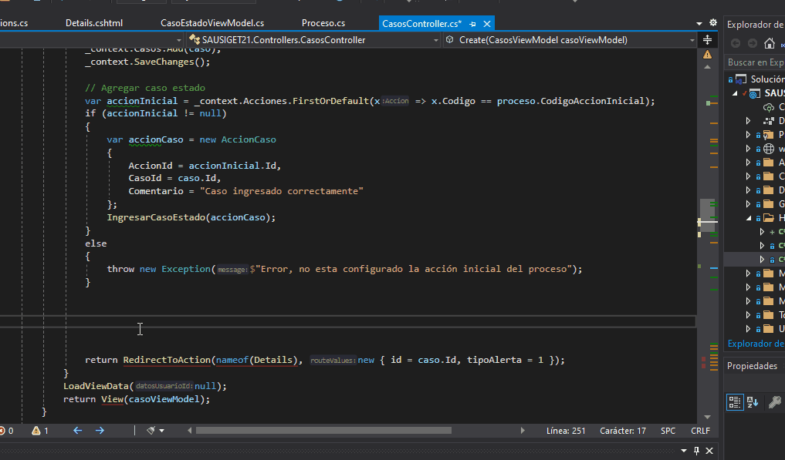

# Como agregar notificaciones temporales
## Instalar sweetalert2 al proyecto .netcore o .net
Lo primero que se debe hacer es la instalación de la librería javascript sweetalert2 para que pueda ser utilizada en el proyecto.
Existen dos formas de instalarlo, una vía el administrador de paquetes del lado del cliente de Visual Studio y la otra es a traves de copar los links del CDN de la librería.
### Instalación vía Administrador de bibliotecas del lado del cliente de Visual Studio
Lo primero es acceder al administrador de biblioteca del lado cliente de de VS, dando clic derecho al proyecto y escogiendo la opción **Agregar** y luego la opción **Biblioteca del lado cliente...**

Cuando aparezca la cuadro de **Agregar biblioteca de lado cliente** en la opción de proveedor escoger **jsdelivr** ya que ahí se encuentra la librería, en la opción de biblioteca, escribimos sweetalert2 hasta que nos aparezca la opción, la escogemos y luego damos clic en instalar, tal y como se muestra a continuación.



Al finalizar ese proceso, ya tendríamos instalado la librería sweetalert2 y procederíamos a la configuración para utilizarla.

### Configuración en el Layout principal para el uso global en la aplicación
Para la configuración de esta librería, de manera que la podamos ocupar de manera global, es necesario agregar la referencia y la configuración necesaria en el archivo **_Layout.cshtml**, la configuración presentada a continuación es para mostrar tres tipos de mensajes, de **exito , alerta, error**. 

Este codigo se agrega en la parte de los scripts. Debe estar despues de la librería de **JQuery** ya que este lo utiliza.

```csharp
<!-- sweetalert2 -->
<script src="~/lib/sweetalert2/dist/sweetalert2.all.js"></script>
<script>
    $(function () {
        var message = $('#swalMessage').val();
        var typeMessage = $('#swalMessage').data('tipomensaje');
        if (message != null) {
            switch (typeMessage) {
                case "success":
                    Swal.fire({
                        position: 'top-end',
                        icon: 'success',
                        title: message,
                        showConfirmButton: false,
                        timer: 1500
                    });
                    break;
                case "warning":
                    Swal.fire({
                        position: 'top-end',
                        icon: 'warning',
                        title: message,
                        showConfirmButton: false,
                        timer: 1500
                    });
                    break;
                case "danger":
                    Swal.fire({
                        position: 'top-end',
                        icon: 'error',
                        iconColor: 'red',
                        title: message,
                        showConfirmButton: false,
                        timer: 1500
                    });
                    break;
            }
        }
    });
</script>
```

Dentro del body, debe de ir el siguiente código, que servirá para cuando desde el controlador se envíe un mensaje con el helper **TempData** este almacene el mensaje y lo podamos leer desde el javascript.

```csharp
@if (TempData["alertMessage"] != null)
{
    <input type="hidden" id="swalMessage" value="@TempData["alertMessage"]" data-tipomensaje="@TempData["typeMessage"]" />
}
```

En este caso se colocó dentro del main content justo antes del **@RenderBoby**, aúnque como se trata de un input de tipo hidden, se puede colocar donde se estime conveniente siempre dentro del body.

```csharp
<!-- Main content -->
    <section class="content">
        <div class="container-fluid">
            @if (TempData["alertMessage"] != null)
            {
                <input type="hidden" id="swalMessage" value="@TempData["alertMessage"]" data-tipomensaje="@TempData["typeMessage"]" />
            }
            @RenderBody()
        </div>
    </section>
<!-- /.content -->
```
### Configuración de las funciones extendidas del TempData
Lo siguente a realizar es la creación de una clase que nos servirá para extender las funcionalidades al helper **TempData**

A continuación creamos la siguiente clase, puedes crear una carpeta llamadas Extensions y guardarla ahí.

```csharp
using Microsoft.AspNetCore.Mvc.ViewFeatures;

namespace SAUSIGET21.Helper
{
    public static class AlertMessageTypes
    {
        public const string Success = "success";
        public const string Warning = "warning";
        public const string Danger = "danger";
    }

    public static class TempDataExtensions 
    {
        public static void AlertSuccessMessage(this ITempDataDictionary tempData, string message)
        {
            var typeMessage = AlertMessageTypes.Success;
            tempData["alertMessage"] = message;
            tempData["typeMessage"] = typeMessage;
        }

        public static void AlertWarningMessage(this ITempDataDictionary tempData, string message)
        {
            var typeMessage = AlertMessageTypes.Warning;
            tempData["alertMessage"] = message;
            tempData["typeMessage"] = typeMessage;
        }

        public static void AlertDangerMessage(this ITempDataDictionary tempData, string message)
        {
            var typeMessage = AlertMessageTypes.Danger;
            tempData["alertMessage"] = message;
            tempData["typeMessage"] = typeMessage;
        }
    }
}
```

Con la creación de esta clase, se agregan los métodos al helper **TempData**, que al utilizarlo se veran de la siguiente manera.



